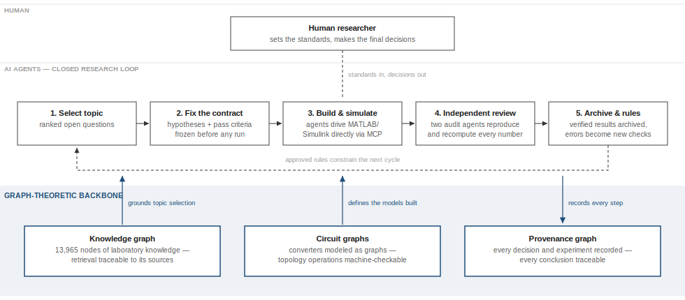
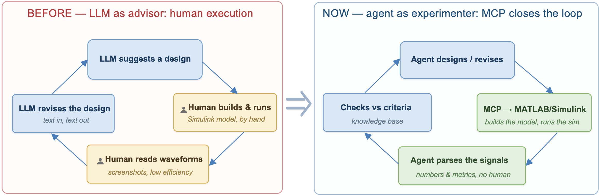
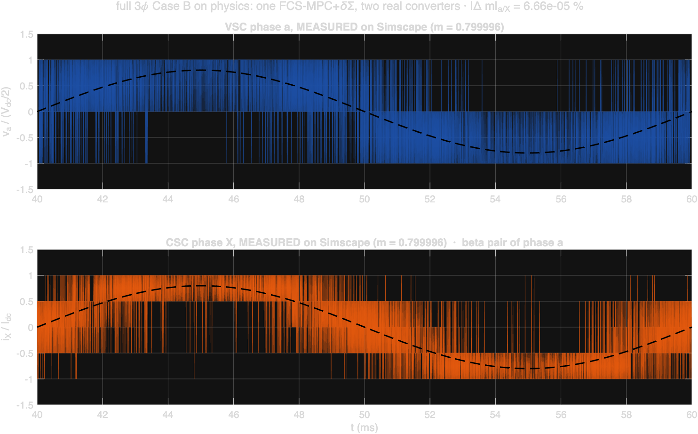
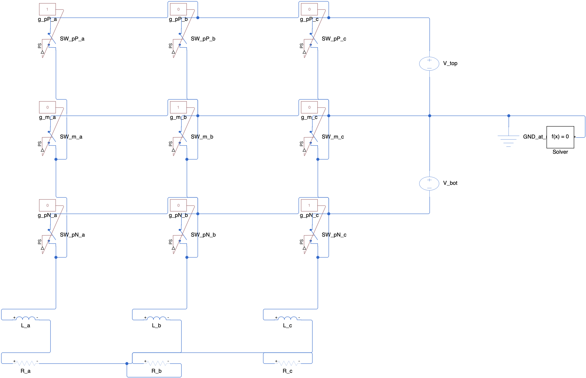
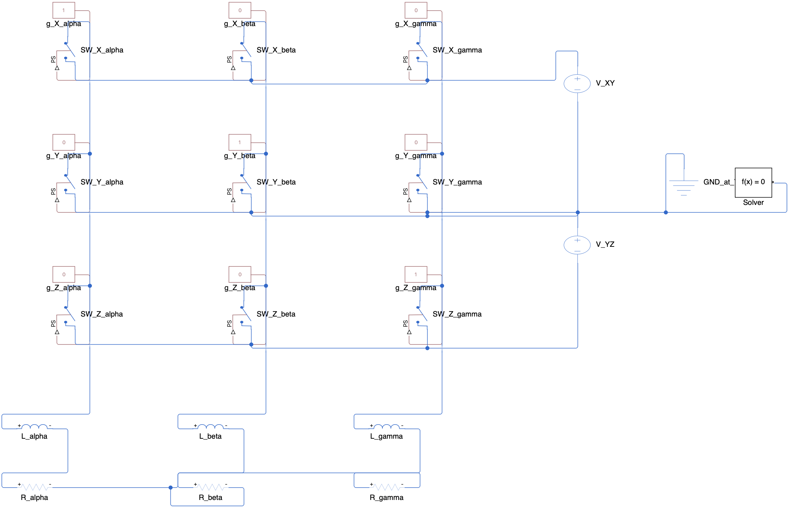
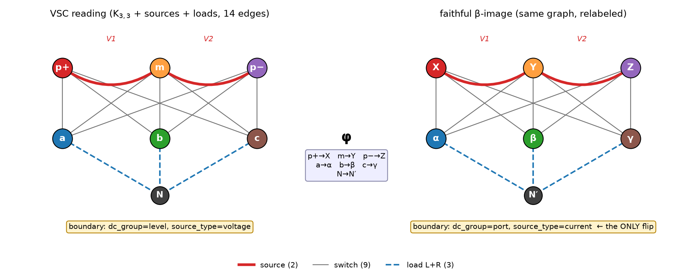
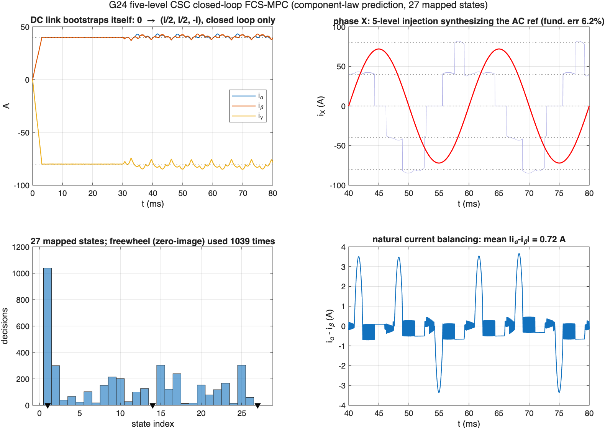
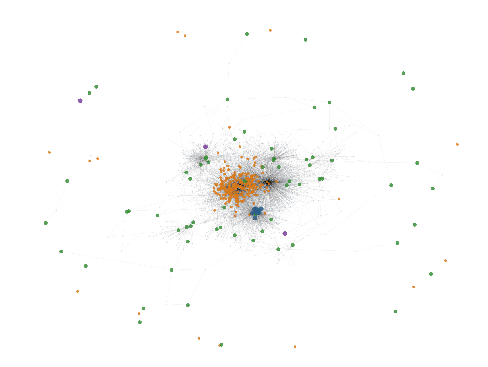
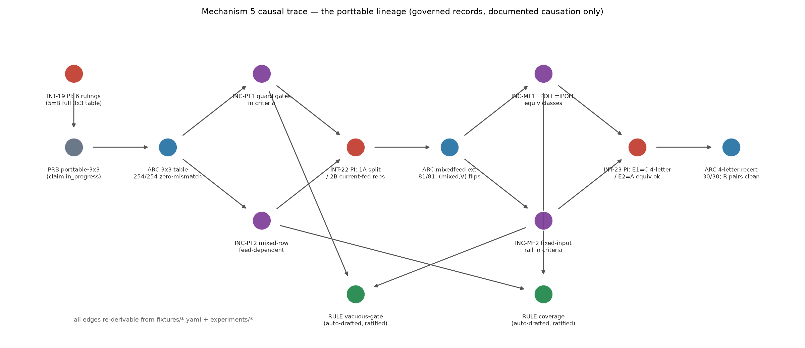

# Graph-Driven Agentic Research Automation

A closed-loop research workflow for power electronics, combining
graph-based modeling, AI agents with direct tool access, and
switched-circuit simulation.

*ELITE Grid Research Lab*

---

## Overview

This repository describes a working methodology in which AI agents carry
out the complete research cycle for power-electronic converters: selecting
the topic, designing and running experiments, independently verifying the
results, evaluating them against engineering standards, and archiving the
outcome. The human researcher supervises the process, sets the standards,
and makes the final decisions.

*The workflow at a glance: a closed agent loop under human supervision,
running on a graph-theoretic backbone — the knowledge graph grounds what to
study, circuit graphs define what gets built and simulated, and the
provenance graph records everything that happens.*

## Why this combination

The workflow combines three components. Each is established on its own;
the practical capability comes from using them together.

### 1. Graph-based modeling

Language models are unreliable when they work directly on unstructured
material such as prose, slides, and informal notes. Graphs provide a
uniform formal representation that can be enumerated, counted, and tested.
This workflow uses graphs in three places:

- **Circuit graphs.** Converters are modeled as graphs (components as
  edges, junctions as nodes), so topology derivation and design
  translation become well-defined operations whose results can be checked
  mechanically.
- **A knowledge graph.** The laboratory's accumulated knowledge —
  publications, experiment reports, and verified textbook facts — is
  indexed as a graph of 13,965 nodes, so retrieval is traceable to its
  sources.
- **A provenance graph.** Decisions, experiments, and rules are recorded
  as a graph, so every conclusion can be traced back to the record that
  produced it.

The graph-theoretic foundation is developed in the laboratory's monograph,
[*Graph Theory in Power Converters*](https://www.wiley.com/en-ca/shop/general-energy/graph-theory-in-power-converters-from-fundamentals-to-applications-p-9781394222292)
(Wiley; see References).

### 2. AI agents with direct tool access

Through the [Model Context Protocol (MCP)](https://modelcontextprotocol.io),
the agents operate professional engineering software directly: they build
and run simulations, process measurement data, and execute large
enumerations in parallel. The MATLAB/Simulink connection uses MathWorks'
[Simulink Agentic Toolkit](https://github.com/matlab/simulink-agentic-toolkit). The work is
divided among separate roles. A research agent performs the study; a first
review agent independently reproduces and recomputes every reported
number; a second review agent examines the interpretation for errors.
Findings from review are recorded and converted into permanent automated
checks.

*Left: a language model used as an advisor — every iteration stalls at a
human relay (building the model, reading waveforms, retyping numbers).
Right: this workflow — the agent operates MATLAB/Simulink directly through
MCP, parses the signals itself, and checks the results against pass/fail
criteria fixed before the run.*

### 3. Simulation in Simulink/Simscape

Every claim is checked against switched-circuit simulation with device
models: waveforms, harmonic content, and power balance. Acceptance
criteria are fixed before an experiment runs, and simulation results —
not model assertions — decide whether a claim is accepted.

**In combination:** graphs make the subject matter and the knowledge base
machine-checkable, MCP gives the agents direct access to engineering
tools, and simulation provides the physical reference. The result is a
research cycle that completes in hours, with every reported number
traceable to an archived result file.

## Selected results

*Simulated three-phase waveforms of a converter design and its machine-translated
twin: phase-voltage PWM of the voltage-source converter (three-level) and
phase-current PWM of the resulting current-source converter (five-level).
Both models were built and simulated in MATLAB/Simulink by the agents.*

| | |
|---|---|
|  |  |

*Agent-built Simulink/Simscape models: the voltage-source converter (left) and
its current-source counterpart (right), constructed block-by-block from the
graph representation — not drawn by hand.*

| | |
|---|---|
|  |  |

*Left: the graph representation behind both circuits — the same graph read two
ways. Right: closed-loop start-up of the five-level current-source inverter
from zero stored energy (see the case study for details).*

*The laboratory knowledge graph that grounds agent retrieval — publications,
experiment reports, and verified textbook facts indexed as one connected
structure (shown unlabeled).*

*A slice of the provenance graph: the documented causal chain behind one
research finding — problem claims, experiment arcs, supervisor rulings,
incident reports, and the automated rules they produced. Every edge is
re-derivable from the archived records.*

## Contents

| | |
|---|---|
| [`docs/presentation.html`](docs/presentation.html) | A 20-slide overview (self-contained HTML; download and open, navigate with arrow keys). Written for engineers without prior background in AI or graph theory. |
| [`case-studies/five-level-csc-mpc/`](case-studies/five-level-csc-mpc/) | Case study: a five-level current-source inverter taken from a paper topology to grid-quality closed-loop operation in one working day, including the controller revisions that failed. |
| [`methodology/`](methodology/) | The research pipeline, the supporting tools, and the governance process. |
| [`docs/agentic_ai_matlab_simulink_mcp_tutorial_en.md`](docs/agentic_ai_matlab_simulink_mcp_tutorial_en.md) | Beginner-friendly tutorial: set up an AI coding agent to operate MATLAB/Simulink directly through MCP — the same connection used in this workflow. No prior MCP knowledge assumed. |

## References

- Yuzhuo Li and Yunwei Li, [*Graph Theory in Power Converters: From
  Fundamentals to Applications*](https://www.wiley.com/en-ca/shop/general-energy/graph-theory-in-power-converters-from-fundamentals-to-applications-p-9781394222292),
  Wiley (ISBN 978-1-394-22229-2). The graph-theoretic foundation of this
  workflow.
- Y. Li, J. Kuprat, Y. Li, and M. Liserre, "Graph-Theory-Based Derivation,
  Modeling, and Control of Power Converter Systems," *IEEE Journal of
  Emerging and Selected Topics in Power Electronics*, 2022.
- R. W. Erickson and D. Maksimović, *Fundamentals of Power Electronics*,
  3rd ed., Springer, 2020. The classical reference used for
  machine-verified textbook facts.
- IEEE Std 1547-2018, *Standard for Interconnection and Interoperability
  of Distributed Energy Resources*. Acceptance limit for grid-current
  distortion.
- IEEE Std 519, *Recommended Practice and Requirements for Harmonic
  Control in Electric Power Systems*.
- J. Jumper et al., "Highly accurate protein structure prediction with
  AlphaFold," *Nature* 596, 2021.
- D. A. Boiko et al., "Autonomous chemical research with large language
  models," *Nature* 624, 2023.
- A. Merchant et al., "Scaling deep learning for materials discovery,"
  *Nature* 624, 2023.
- [Model Context Protocol (MCP)](https://modelcontextprotocol.io), the
  open interface through which the agents operate MATLAB/Simulink and
  other software. The MATLAB/Simulink side is provided by the
  [Simulink Agentic Toolkit](https://github.com/matlab/simulink-agentic-toolkit)
  and the [MATLAB MCP Core Server](https://github.com/matlab/matlab-mcp-core-server).

## Project status

This is an ongoing project. The methodology and its supporting source code
— the graph tooling, the agent harness, and the governance pipeline — are
under active development and not yet public. Components will be shared
selectively as they mature; this repository will be updated as that
happens.

## License

Content (documents, figures, slides) © ELITE Grid Research Lab, licensed
under [CC BY-NC-ND 4.0](LICENSE). Cite as: ELITE Grid Research Lab,
"Graph-Driven Agentic Research Automation," 2026.
